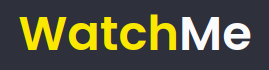

<h1 align="center">
  
</h1>

<p align="center">
  
  
</p>

<br />

> No segundo desafio da trilha ReactJS, consiste em refatorar toda a lógica contida no App, separando-as nos componentes: **SideBar** e **Content**.

<br />

https://user-images.githubusercontent.com/59969985/134594545-3cb44247-2af0-4f2f-82a8-314be2c8b7db.mp4

<br />

# :pushpin: Conteúdo

- [Tecnologias](#computer-tecnologias)
- [Como Executar](#construction_worker-executando)
- [Licença](#memo-licença)

# :computer: Tecnologias

- [React](https://reactjs.org/)
- [Typescript](https://www.typescriptlang.org/)
- [Axios](https://axios-http.com/docs/intro)
- [Webpack](https://webpack.js.org)
- [Babel](https://babeljs.io)
- [SASS](https://sass-lang.com)
- [cross-env](https://www.npmjs.com/package/cross-env)
- [JSON Server](https://github.com/typicode/json-server)

# :construction_worker: Executando

```bash
## Clonar o repositório

git clone git@github.com:martinsgabriel1956/watch-me_ignite.git

## ou

git clone https://github.com/martinsgabriel1956/watch-me_ignite.git

## Instale as dependência

npm i/install

## ou

yarn

## Execute o JSON Server

npm run server

## ou

yarn server

## Execute o projeto 

npm run start

## ou

yarn start
```

# :memo: Licença

Esse projeto está sob a licença MIT. Veja o arquivo [LICENSE](LICENSE.md) para mais detalhes.

